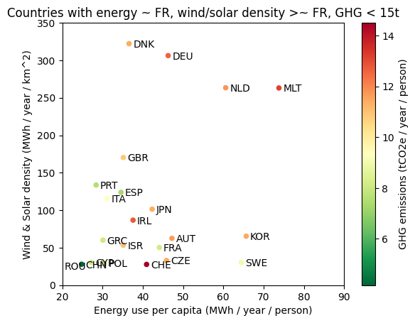

# Renewable electricity study

## Motivation

**Is France really lagging behind other countries** in terms of renewable power deployment? Could we do better without too much sacrifice?

Let's fact check it.

## Results



Portugal, Spain, Italy (and Greece to a lesser extent) tackle the triple challenge of:
1. a higher wind/solar density than France;
2. an acceptable carbon footprint (for now);
3. an energy use yet compatible with good living standards.

[Full results](https://htmlpreview.github.io/?https://github.com/rkz/renewables/blob/master/result/main.html)

## How to run

```
$ pip install -r requirements.txt
$ jupyter nbconvert --to html main.ipynb
```

## License


